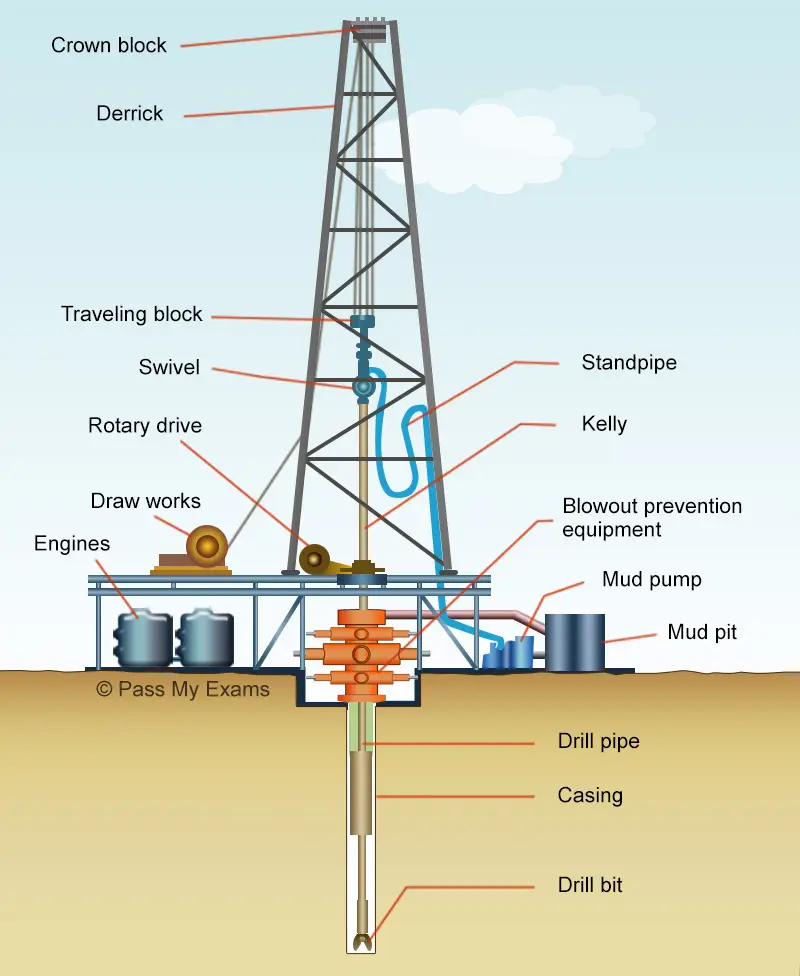
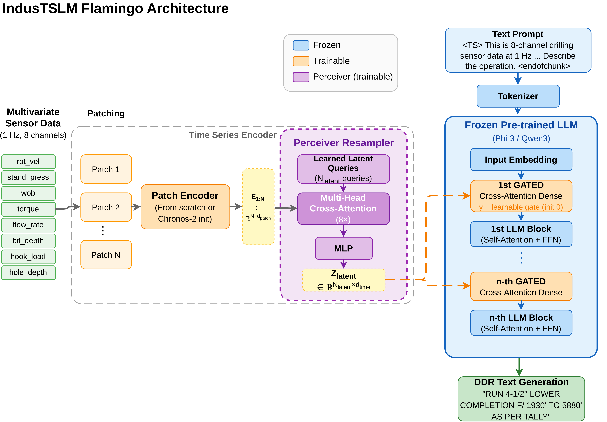
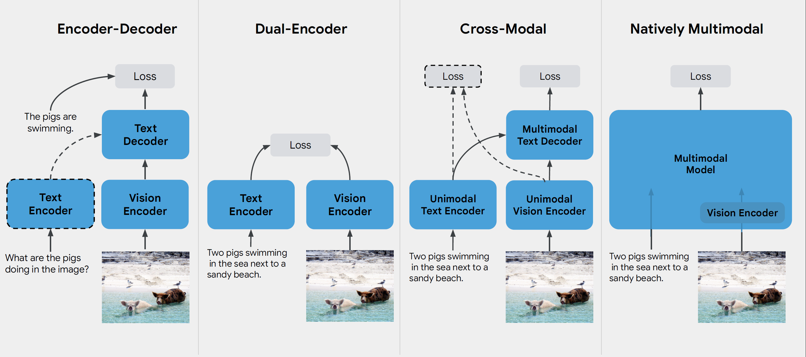
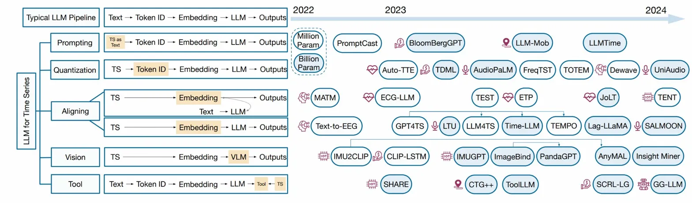

# IndusTSLM: Exploring Time-Series Language Models for Drilling Data

> This repository builds on the **OpenTSLM** open-source project ([github.com/StanfordBDHG/OpenTSLM](https://github.com/StanfordBDHG/OpenTSLM)) under the MIT license. The drilling-specific extensions (DriMM, IndusTSLM-Flamingo for drilling, DrillBench) were developed by Yahia Salaheldin Shaaban in coordination with the **AIQ Intelligence** team during the master's thesis at MBZUAI.

## Overview

Modern oil and gas drilling generates ~700,000 sensor measurements per wellbore per day, paired with engineer-written Daily Drilling Reports (DDRs). IndusTSLM investigates whether the multimodal alignment paradigms that bridged vision and language (CLIP, Flamingo, LLaVA) can also bridge **industrial sensor time series and natural language**.

This work presents a progressive architectural exploration on real ADNOC drilling data, from contrastive dual-encoder alignment to generative time-series language models, culminating in a standardized benchmark for the drilling domain.

<p align="center">
   
</p>

*A representative window of 8-channel surface sensor data (hook load, torque, rotary velocity, standpipe pressure, flow rate, bit depth, hole depth, block position) sampled at 1 Hz. Different drilling activities (DRILL, TRIP, CIRC) produce visually distinct signatures, which is precisely what makes the modality learnable but also what makes naive lexical matching insufficient.*

## Contributions

### 1. DriMM: Dual-Encoder Multimodal Alignment
*Developed in coordination with the AIQ team: Sebastiaan Buiting\*, Soumyadipta Sengupta\*, Abdallah Benzine, and Amine El Khair (\*equal contribution).*

A contrastive (CLIP-style) model that learns joint embeddings of multivariate drilling sensor windows and DDR text. Extended with **hard negative mining** via small-LLM-derived semantic similarity, yielding ~8% average improvement across retrieval, zero-shot classification, and linear probing. Trained on 145,715 paired samples from over 650 wells.

<p align="center">
   
</p>

*DriMM dual-encoder architecture. A pretrained time-series foundation model (Moirai or MOMENT) encodes sensor windows; a domain-adapted RoBERTa encodes DDR text. Both projections are L2-normalized into a shared 256-d embedding space and aligned via the symmetric InfoNCE objective. Hard negatives, mined from a small language model, are injected per batch to push the contrastive boundary between operationally similar but distinct activities.*

### 2. IndusTSLM: Generative Time-Series Language Models
*Developed in coordination with the AIQ team: Abdallah Benzine and Amine El Khair.*

Two architectural paradigms for DDR text generation, compared on identical drilling data:

* **LiveDrill (Soft Prompting):** real-time activity segmentation combined with LLaVA-style soft prompting for streaming report generation.
* **IndusTSLM Flamingo (Cross-Attention):** Perceiver Resampler plus gated cross-attention layers injected into a frozen LLM, trained with a two-stage curriculum (activity classification, then free-form DDR generation).

Both are evaluated using a domain-specific **LLM-as-Judge** framework (Llama 3 70B, validated against human experts at ICC = 0.769).

<p align="center">
   
</p>

*The IndusTSLM Flamingo architecture: multivariate sensor patches are encoded and compressed by a Perceiver Resampler into a fixed-size latent representation. Gated cross-attention layers, interleaved within the frozen LLM, attend to temporal features. Special tokens (`<TS>` and `<endofchunk>`) delimit time-series segments. Components in orange are trainable; blue components remain frozen.*

### 3. DrillBench: Standardized Benchmark *(ongoing work)*
*Developed in coordination with the AIQ team: Abdallah Benzine and Amine El Khair.*

The first comprehensive benchmark for evaluating TSLMs on drilling operations: **7 task types across 4 groups** (Classification & Understanding, Generation, Physical Reasoning, Forecasting), targeting roughly 150,000 instances built on the public Volve Field and Utah FORGE datasets. Introduces a **knowledge-decoupling framework** that distinguishes genuine sensor analysis from pretrained domain-knowledge recall.

> ⚠️ DrillBench is **still under active development**: task templates, distractor mining, and the full-scale evaluation harness are being refined. The numbers reported in the thesis are baselines on a stratified subset and should be interpreted as indicative.

## Background: VLM to TSLM Analogy

The vision-language community converged on four recurring patterns for fusing pixels with text. IndusTSLM treats these as a design vocabulary and asks which patterns transfer to multivariate industrial time series.

<p align="center">
   
</p>

*The four major VLM families. **Encoder–Decoder** (e.g., Show & Tell): a vision encoder feeds a text decoder, good for captioning but weak at fine-grained reasoning. **Dual-Encoder** (CLIP, ALIGN, SigLIP): independent encoders aligned by a contrastive loss; strong for retrieval and zero-shot classification but non-generative. **Cross-Modal** (Flamingo, BLIP-2, CoCa): unimodal encoders fused through cross-attention into a multimodal decoder; balances retrieval and generation. **Natively Multimodal** (LLaVA, Qwen-VL, GPT-4V): early fusion of patches and text tokens in a single transformer. Adapted from Stretcu (2025).*

In the time-series world the same fusion taxonomy is just emerging. The figure below surveys how recent work integrates time series into LLMs.

<p align="center">
   
</p>

*Five strategies for injecting time series into LLMs: **prompting** (serialize values as text tokens), **quantization** (discrete token IDs from a learned codebook), **aligning** (project encoder embeddings into the LLM space, with or without joint training), **vision** (render the series as a plot and route through a VLM), and **tool use** (the LLM calls external time-series tools). Soft prompting and cross-attention dominate the "aligning" branch and are the two paradigms compared in this thesis. Adapted from Zhang et al. (2024).*

This thesis instantiates the **dual-encoder** pattern as DriMM (Section: Contributions, item 1) and the **cross-modal** pattern as IndusTSLM-Flamingo (item 2), then evaluates both on real industrial drilling data.

## Key Findings

* **Domain-specific encoders outperform general-purpose foundation models.** Lightweight CNNs trained on drilling sensor dynamics consistently match or exceed MOMENT and Moirai, suggesting that distinctive industrial sensor signatures are underrepresented in general TSFM pretraining corpora.
* **The quantitative fidelity gap is fundamental.** All architectures reliably identify activity *type* (primary operation match 0.52–0.65) but struggle with precise numerical details (depth accuracy below 0.06, parameter fidelity below 0.04). Addressing this likely requires number-aware tokenization or auxiliary regression heads.
* **Knowledge decoupling matters.** On DrillBench's counterfactual reasoning task, commercial LLMs gain only 3.3 to 5.6 points from sensor data over prompt-only baselines; most "performance" comes from memorized drilling knowledge. Instruction-tuned IndusTSLM widens this gap to 18.7 points, indicating it actually learns from the sensor patterns.
* **Cross-attention vs. soft prompting.** Both paradigms perform comparably; the bottleneck lies in the encoder's ability to preserve quantitative information rather than in the fusion mechanism.

## Repository Structure

```
IndusTSLM/
├── assests/                    # Figures and full thesis PDF
│   └── industslm.pdf
├── src/                        # Model implementations
├── data/                       # Data processing pipelines
├── evaluation/                 # LLM-as-Judge framework
├── scripts/                    # Training and analysis scripts
├── notebooks/                  # Exploratory analysis
├── demo/                       # Demonstration scripts
├── contrastive_pretraining.py  # DriMM training
├── curriculum_learning.py      # IndusTSLM two-stage curriculum
├── train_cott.py               # Chain-of-thought training
└── evaluate_*.py               # Evaluation scripts
```

The full manuscript is available at [`assests/industslm.pdf`](assests/industslm.pdf).

## Installation

```bash
git clone https://github.com/<your-username>/IndusTSLM.git
cd IndusTSLM

# Recommended: uv environment management
command uv > /dev/null || curl -LsSf https://astral.sh/uv/install.sh | sh
uv sync --all-groups
source .venv/bin/activate

# Or via pip:
pip install -r requirements.txt
```

## Training

IndusTSLM uses a two-stage curriculum:

```bash
# Stage 1: Activity code classification (encoder warmup)
python curriculum_learning.py --model OpenTSLMFlamingo --stages stage1_classification

# Stage 2: DDR text generation
python curriculum_learning.py --model OpenTSLMFlamingo --stages stage2_generation

# Full curriculum
python curriculum_learning.py --model OpenTSLMFlamingo
```

Supported backbones: Phi-3 mini (3.8B), Qwen3 4B, with Chronos-2 or CNN time-series encoders.

## License

MIT License. See [LICENSE.md](LICENSE.md).

## Thesis, Publications, and Acknowledgments

This repository accompanies the Master's thesis **"IndusTSLM: Exploring Time-Series Language Models for Drilling Data"** completed at the **Mohamed bin Zayed University of Artificial Intelligence (MBZUAI)**, Department of Machine Learning.

* **Author:** Yahia Salaheldin Shaaban
* **Supervisors:** Dr. Salem Lahlou, Dr. Martin Takáč
* **Industry collaboration:** AIQ Intelligence (ADNOC drilling operations)

### Publications

The thesis work resulted in three peer-reviewed publications:

1. **LiveDrill: Multimodal Segment-Triggered Data-to-Text for Time Series Foundation Models.** *NeurIPS 2025 Workshop (Bert2S).*
2. **LLMs as Judges for Domain-Specific Text: Evidence from Drilling Reports.** *NeurIPS 2025 Workshop (Evaluating the Evolving LLM Lifecycle).*
3. **Streaming Drilling Report Generation with Live Segmentation and Multimodal Text Generation.** *IEEE Big Data Conference 2025.*

### Acknowledgments

This repository builds directly on the **OpenTSLM** open-source project: [https://github.com/StanfordBDHG/OpenTSLM](https://github.com/StanfordBDHG/OpenTSLM). The IndusTSLM extensions adapt that codebase to the industrial drilling domain.

The drilling work was done **in coordination with the AIQ Intelligence team**, with the proprietary dataset provided through collaboration with **AIQ Intelligence** and **ADNOC**:

* **DriMM:** Sebastiaan Buiting\*, Soumyadipta Sengupta\*, Abdallah Benzine, Amine El Khair (\*equal contribution).
* **IndusTSLM and DrillBench:** Abdallah Benzine, Amine El Khair.

Mentorship throughout the project was provided by Abdallah Benzine (project lead, AIQ Intelligence).

### Citation

```bibtex
@mastersthesis{shaaban2026industslm,
  title  = {IndusTSLM: Exploring Time-Series Language Models for Drilling Data},
  author = {Shaaban, Yahia Salaheldin},
  school = {Mohamed bin Zayed University of Artificial Intelligence (MBZUAI)},
  year   = {2026},
  type   = {Master's thesis}
}
```
